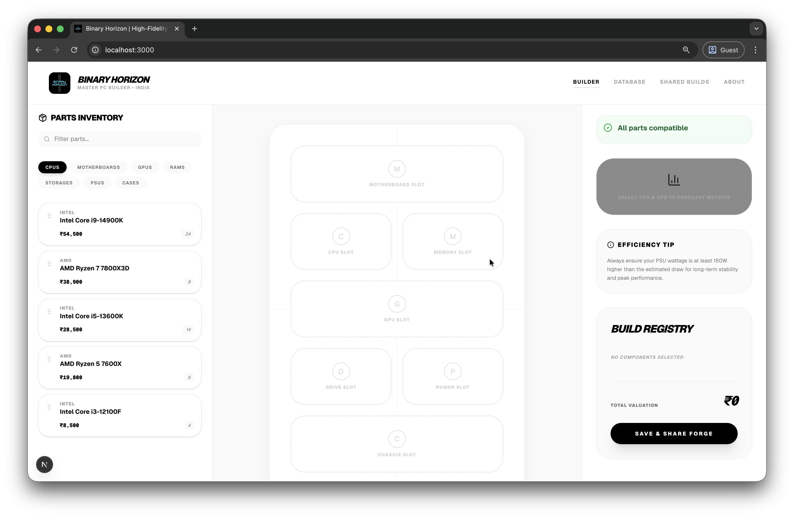
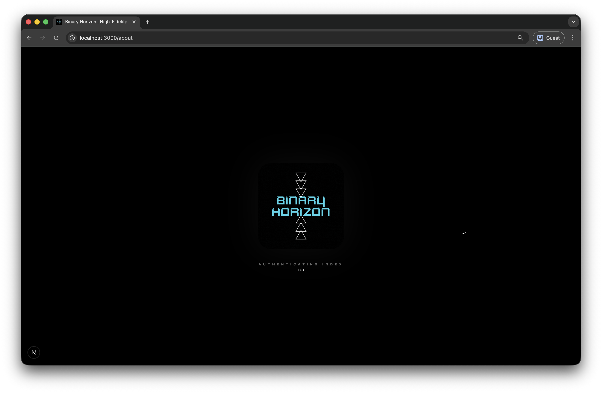
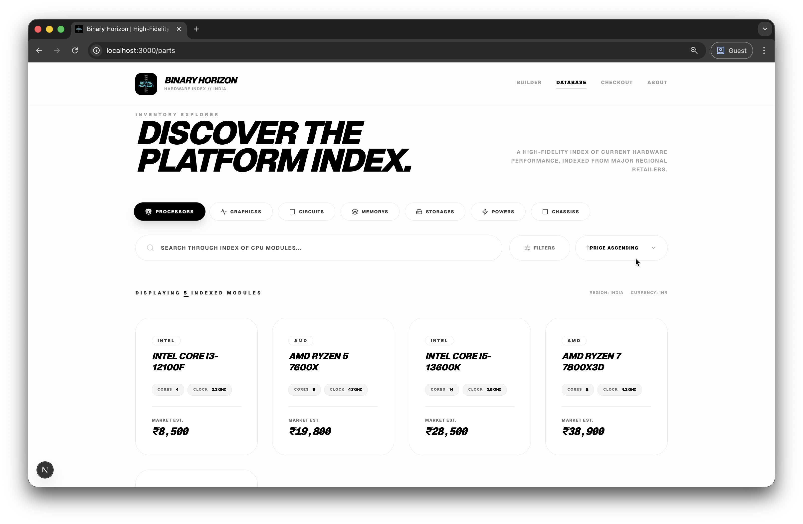
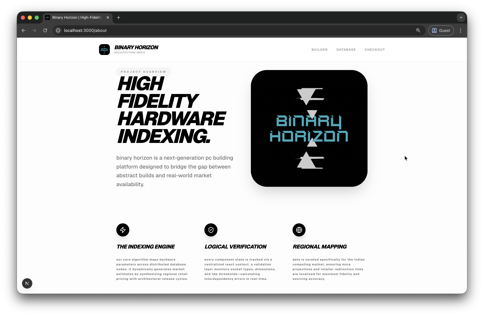

# Binary Horizon | PC Architecture Index

<div align="center">
  
  <br />
  <p><b>A high-fidelity hardware indexing and PC building platform.</b></p>
</div>

---

## 📸 Platform Preview

### 1. **The Assembly Bay**
The heart of Binary Horizon. A reactive, drag-and-drop environment for high-precision PC assembly.


### 2. **Boot Sequence**
High-fidelity splash screen driven by liquid-smooth Framer Motion transitions.


### 3. **Architecture Index**
A comprehensive, high-contrast hardware database with real-time market estimates.


### 4. **Infrastructure Blueprint**
Detailed engineering breakdown of the modern tech stack powering the platform.


---

## 🚀 Key Features

- **Modular Assembly Bay**: Drag-and-drop interface for high-precision PC building.
- **Hardware Indexing**: Deep integration with hardware databases for real-time spec tracking.
- **Logical Verification**: Real-time compatibility checking (Socket, TDP, Physical Clearance).
- **Architecture Blueprint**: Detailed technical breakdown of modern computing hardware.
- **Premium UI**: Fluid animations powered by Framer Motion and a high-contrast design system.

## 🛠️ Tech Stack

- **Framework**: [Next.js 15](https://nextjs.org/)
- **Styling**: [Tailwind CSS 4.0](https://tailwindcss.com/)
- **Animations**: [Framer Motion](https://www.framer.com/motion/)
- **Database**: [MongoDB Atlas](https://www.mongodb.com/atlas/database)
- **State Management**: React Context API
- **Type Safety**: TypeScript

---

## ⚙️ Detailed Installation & Setup

Follow these steps to get your local development environment running.

### 1. **Prerequisites**
- **Node.js**: Version 18.0 or higher.
- **npm**: Version 9.0 or higher (comes with Node.js).
- **MongoDB**: A running instance of MongoDB Atlas (Cloud) or a local MongoDB Server.

### 2. **Clone the Repository**
```bash
git clone https://github.com/Kakashi18-hub/Binary-Horizon-PC-Builder.git
cd Binary-Horizon-PC-Builder
```

### 3. **Install Dependencies**
```bash
npm install
```

### 4. **Configure Environment Variables**
Binary Horizon requires a connection string to your MongoDB instance.
1. Create a file named `.env.local` in the root directory.
2. Add your MongoDB URI to the file:
   ```env
   MONGODB_URI=mongodb+srv://<username>:<password>@cluster.mongodb.net/binary-horizon
   ```
   *Note: If using a local instance, use `mongodb://localhost:27017/binary-horizon`.*

### 5. **Seed the Database**
Before running the app, you need to populate the database with the hardware catalog (CPU, GPU, RAM, etc.).
```bash
npm run seed
```
*This script will clear any existing parts in the `parts` collection and inject the expanded hardware index with updated Indian pricing.*

### 6. **Launch Development Server**
```bash
npm run dev
```
Open [http://localhost:3000](http://localhost:3000) to view the application in your browser.

---

## 📄 License

This project is licensed under the MIT License - see the LICENSE file for details.

---
Developed by **Ujjwal Bachhav**
